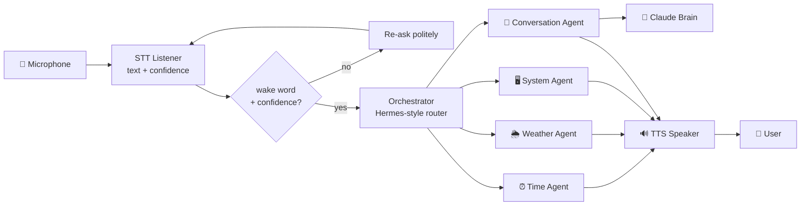

<div align="center">


# Harry

**A voice-only agentic AI assistant — JARVIS / FRIDAY-style, built on a Hermes-style orchestrator.**

[](https://www.python.org/)
[](LICENSE)
[](https://www.anthropic.com/claude)
[](#)

</div>

---

Harry is an experiment in building a Tony-Stark-style personal AI. **You only speak to it. It only speaks back.** No typing, no chat window, no buttons. If Harry mishears you, it asks again — politely — until it's confident enough to act.

Under the hood, a **Hermes-style orchestrator** routes each spoken utterance to a specialist sub-agent (time, weather, system control, free-form conversation). Claude Sonnet 4.6 is the reasoning brain behind the free-form agent.

## Demo


> *(Microphone input and TTS output happen out-of-band — the terminal is just a debug trace of what Harry heard, which agent answered, and what it said back.)*

## Architecture




## Why Hermes-style?

The orchestrator pattern (popularised by NousResearch's *Hermes* models for tool use) keeps each capability isolated in its own agent with explicit triggers, instead of bundling everything into a single mega-prompt. The benefits:

- **Cheap routing** — keyword/heuristic match handles 80% of intents without an LLM round-trip.
- **Auditable behaviour** — every reply is tagged with the agent that produced it.
- **Pluggable** — adding a new skill is just a new `Agent` subclass and one line in `main.py`.
- **Graceful fallback** — anything no specialist claims falls through to the conversational Claude brain.

## Features

- 🎙 **Voice-only I/O** — `SpeechRecognition` for STT, `pyttsx3` for offline TTS
- 🪄 **Wake word** — Harry stays quiet until it hears its name (configurable)
- 🤔 **Confidence-aware** — if STT confidence is below threshold, Harry asks you to repeat instead of guessing
- 🧭 **Hermes orchestrator** — keyword-routed specialist agents with an LLM fallback
- 🧠 **Claude brain with prompt caching** — persona is cached as `ephemeral` to keep cost & latency low
- 🛡 **Safe-list for system control** — Harry will only open apps on an explicit allowlist
- 🇬🇧 **British-butler persona** — concise replies tuned for speech, never markdown

## Quick start

```bash
git clone https://github.com/rudhrancodes-dev/harry-ai.git
cd harry-ai

python3 -m venv .venv && source .venv/bin/activate
pip install -r requirements.txt

cp .env.example .env          # then paste your ANTHROPIC_API_KEY

python main.py
```

Then say:

> *"Harry, what time is it?"*
> *"Harry, weather in Coimbatore."*
> *"Harry, open Safari."*
> *"Harry, explain how isolation forests detect anomalies."*

## Project layout

```
harry-ai/
├── main.py                       # voice loop entry point
├── harry/
│   ├── config.py                 # env-loaded settings
│   ├── brain.py                  # Anthropic SDK wrapper (prompt-cached)
│   ├── voice/
│   │   ├── listener.py           # STT + confidence
│   │   └── speaker.py            # TTS
│   └── agents/
│       ├── base.py               # Agent ABC
│       ├── orchestrator.py       # Hermes-style router
│       ├── time_agent.py
│       ├── weather_agent.py
│       ├── system_agent.py
│       └── conversation_agent.py # Claude fallback
├── tests/test_orchestrator.py
├── docs/
│   ├── generate_screenshots.py
│   └── screenshots/{banner,architecture,demo}.png
├── requirements.txt
├── .env.example
└── LICENSE
```

## Configuration

| Env var                | Default                 | Notes                                       |
| ---------------------- | ----------------------- | ------------------------------------------- |
| `ANTHROPIC_API_KEY`    | *(required)*            | from [console.anthropic.com](https://console.anthropic.com) |
| `HARRY_MODEL`          | `claude-sonnet-4-6`     | any Anthropic chat model                    |
| `HARRY_WAKE_WORD`      | `harry`                 | set to empty to disable wake-word gating    |
| `HARRY_STT_ENERGY`     | `300`                   | mic energy threshold for VAD                |
| `HARRY_STT_PAUSE`      | `0.8`                   | seconds of silence that ends an utterance   |
| `HARRY_MAX_CLARIFY`    | `2`                     | how many times Harry will re-ask before giving up |
| `OPENWEATHER_API_KEY`  | *(optional)*            | enables the weather agent                   |

## Running tests

```bash
python -m pytest -q
```

The orchestrator routing tests don't touch the microphone, the speaker, or the network — they verify that the router picks the right specialist for representative utterances.

## Roadmap

- [ ] Swap `SpeechRecognition`'s Google backend for local `faster-whisper`
- [ ] Persistent conversation memory (SQLite or vector store)
- [ ] Native Claude tool-use API instead of keyword triggers (true Hermes-style function calling)
- [ ] Streaming TTS so Harry can start speaking before generation finishes
- [ ] Cross-platform `SystemAgent` (Windows / Linux)

## Inspiration

- **JARVIS** & **FRIDAY** — Tony Stark's assistants in the Iron Man / MCU films
- **NousResearch Hermes** — orchestrator + tool-use architecture
- **Aegis** — my earlier ML-on-the-edge anomaly-detection project ([rudhran.netlify.app](https://rudhran.netlify.app))

## License

MIT © [Rudhran B.](https://github.com/rudhrancodes-dev)
