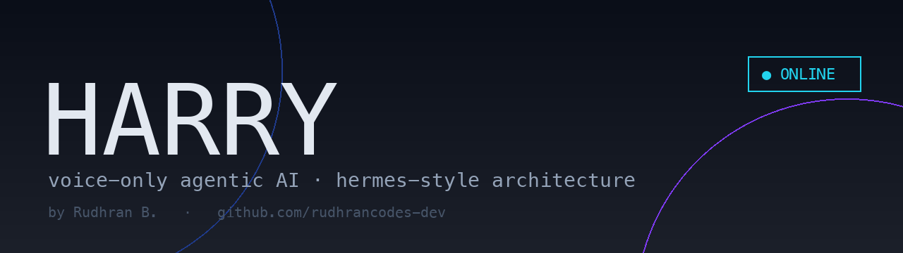
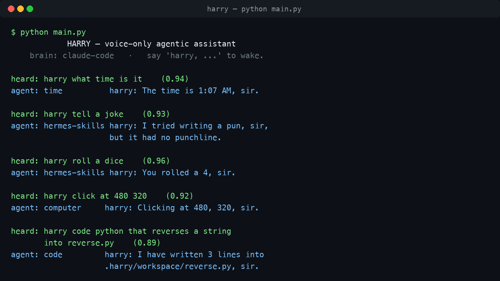
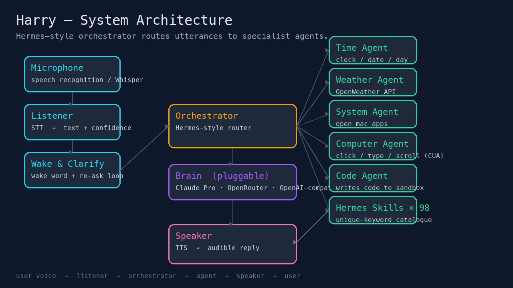
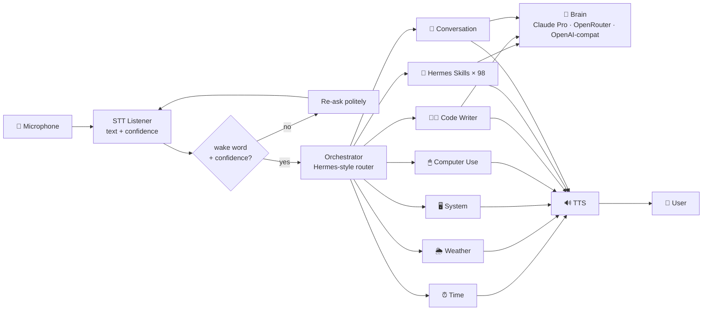

<div align="center">



# Harry

**Voice-only agentic AI — JARVIS / FRIDAY-style — with a Hermes-style orchestrator, 98-skill catalogue, computer-use agent, and a pluggable LLM brain.**

[](https://www.python.org/)
[](LICENSE)
[](#brain-backends)
[](#the-98-skill-catalogue)
[](#)

</div>

---

Harry is a Tony-Stark-style personal AI. **You only speak to it. It only speaks back.** No typing, no chat window, no buttons. If Harry mishears you, it asks again — politely — until it's confident enough to act.

Under the hood, a **Hermes-style orchestrator** routes each utterance to the best specialist agent: a clock, weather, mac system control, computer-use (cursor / type / scroll), a code-writing agent that drops files in your workspace, a 98-skill catalogue with strictly non-overlapping keyword triggers, and finally a free-form conversation agent that runs through whichever LLM brain you pick.

## Demo



> *(Microphone input and TTS output happen out-of-band — the terminal is just the trace of what Harry heard, which agent answered, and what it said back.)*

## Architecture





## Brain backends

Harry doesn't lock you into one provider. Pick a backend by setting **`HARRY_BRAIN`** in your `.env`:

| Backend         | What it does                                                            | What it needs                                              |
| --------------- | ----------------------------------------------------------------------- | ---------------------------------------------------------- |
| `claude-code`   | Shells out to the `claude` CLI in non-interactive mode (`claude -p`). Uses your **Claude Pro / Max** plan — browser-authenticated, **no API key required**. | `claude` on PATH and `claude /login` once.                 |
| `openrouter`    | One key, hundreds of models. Default model: **DeepSeek V3** (`deepseek/deepseek-chat-v3-0324`). | `OPENROUTER_API_KEY`, optionally `OPENROUTER_MODEL`.       |
| `openai-compat` | Any OpenAI-compatible endpoint — **opencode**, Ollama, vLLM, DeepSeek direct, Groq, Together, LM Studio. | `OPENCODE_API_KEY` (if needed), `OPENCODE_BASE_URL`, `OPENCODE_MODEL`. |
| `off`           | Disable the LLM entirely; only deterministic skills will work.          | nothing.                                                   |

The brain is invoked by `ConversationAgent`, `CodeAgent`, and any of the 98 skills marked `handler="llm"`. Everything else (calculator, dice, screenshot, battery, etc.) runs without a model.

## The 98-skill catalogue

`harry.skills.registry` defines exactly **98 narrow skills** across 10 categories. **Every trigger phrase in the catalogue is globally unique** — there are no overlapping keywords between skills. The test suite (`tests/test_skills.py`) enforces this as a build invariant:

```python
def test_every_trigger_is_globally_unique():
    triggers = [t for s in SKILLS for t in s.triggers]
    dupes = [k for k, v in Counter(t.lower() for t in triggers).items() if v > 1]
    assert not dupes
```

Categories:

| Category        | Count | Examples                                                       |
| --------------- | :---: | -------------------------------------------------------------- |
| `info`          | 10    | calculator · dictionary · timezone-lookup · thesaurus          |
| `creative`      | 10    | joke · story · poem · haiku · plot-twist · metaphor            |
| `productivity`  | 10    | reminder · timer · pomodoro · todo · note · brainstorm         |
| `comm`          |  8    | email-draft · text-draft · translate · paraphrase · proofread  |
| `knowledge`     | 10    | eli5 · trivia · math-solve · physics · chemistry · biology     |
| `code`          |  8    | code-snippet · debug · regex · git-help · algorithm            |
| `system`        |  8    | close-app · volume · brightness · screenshot · lock-screen · battery |
| `health`        |  8    | workout · recipe · meditation · breathing · sleep-tip · stretch |
| `ent`           |  8    | movie · book · music · game · anime · podcast · tv · fun-fact  |
| `math`          |  8    | percent · tip · age · distance · °C↔°F · kg↔lb · roman · binary |
| `social`        | 10    | compliment · motivation · affirmation · apology · thank-you · coin · dice |
| **Total**       | **98**|                                                                |

**Routing**: the `HermesSkillAgent` sorts all triggers by length descending, then picks the longest one that appears in the utterance — so *"convert celsius to fahrenheit"* always beats a shorter trigger that might be a prefix of something else.

## Tools beyond chat

### 🖱 Computer Use agent
```
"harry, click at 480 320"
"harry, type out hello world"
"harry, press key return"
"harry, scroll down by 5"
"harry, move cursor to 100 200"
```
Uses [`cliclick`](https://github.com/BlueM/cliclick) for precision when installed (`brew install cliclick`), AppleScript otherwise. macOS only for now.

### 👨‍💻 Code-writing agent
```
"harry, code python that reverses a string into reverse.py"
"harry, code javascript that debounces a function into debounce.js"
"harry, code bash that finds large files into find_big.sh"
```
Routes the request to the configured Brain, strips fences, and writes the result into `~/.harry/workspace/`. Refuses to write anything outside that sandbox.

### 🎨 Personalisation
```bash
HARRY_USER_NAME=Rudhran            # who Harry is talking to
HARRY_ADDRESS=sir                  # how Harry should address you
HARRY_PERSONA_EXTRA="Reference Tamil engineering jokes when natural."
```
Pulled in by `harry/persona.py` and injected into every LLM call as the system prompt.

## Quick start

```bash
git clone https://github.com/rudhrancodes-dev/harry-ai.git
cd harry-ai

python3 -m venv .venv && source .venv/bin/activate
pip install -r requirements.txt

cp .env.example .env          # pick HARRY_BRAIN and (if needed) paste a key
python main.py
```

Then say:

> *"Harry, what time is it?"*
> *"Harry, tell a joke."*
> *"Harry, calculate 47 times 92."*
> *"Harry, roll a dice."*
> *"Harry, take a screenshot."*
> *"Harry, code python that prints fibonacci into fib.py."*
> *"Harry, explain how isolation forests detect anomalies."*

## Project layout

```
harry-ai/
├── main.py                       # voice loop entry point
├── harry/
│   ├── config.py                 # env-loaded settings
│   ├── persona.py                # personalisable system prompt
│   ├── brain/                    # pluggable LLM backends
│   │   ├── claude_code.py        #   uses `claude` CLI → Claude Pro
│   │   ├── openrouter.py         #   uses OpenRouter (DeepSeek, ...)
│   │   └── openai_compat.py      #   opencode, Ollama, vLLM, ...
│   ├── voice/
│   │   ├── listener.py           # STT + confidence
│   │   └── speaker.py            # TTS
│   ├── agents/
│   │   ├── base.py               # Agent ABC
│   │   ├── orchestrator.py       # Hermes-style router
│   │   ├── time_agent.py
│   │   ├── weather_agent.py
│   │   ├── system_agent.py
│   │   ├── computer_agent.py     # CUA — click / type / scroll
│   │   ├── code_agent.py         # writes files to ~/.harry/workspace
│   │   └── conversation_agent.py # free-form fallback
│   └── skills/
│       ├── registry.py           # 98 Skill definitions
│       ├── handlers.py           # deterministic handlers (no LLM)
│       └── agent.py              # HermesSkillAgent — longest-match router
├── tests/
│   ├── test_orchestrator.py
│   └── test_skills.py            # catalogue invariants (unique triggers etc.)
├── docs/
│   ├── generate_screenshots.py
│   └── screenshots/{banner,architecture,demo}.png
├── requirements.txt
├── .env.example
└── LICENSE
```

## Configuration reference

| Env var                | Default                          | Notes                                          |
| ---------------------- | -------------------------------- | ---------------------------------------------- |
| `HARRY_BRAIN`          | `claude-code`                    | `claude-code` · `openrouter` · `openai-compat` · `off` |
| `OPENROUTER_API_KEY`   | *(empty)*                        | required for `openrouter`                      |
| `OPENROUTER_MODEL`     | `deepseek/deepseek-chat-v3-0324` | any OpenRouter model id                        |
| `OPENCODE_API_KEY`     | *(empty)*                        | optional for local endpoints                   |
| `OPENCODE_BASE_URL`    | `http://localhost:11434/v1`      | Ollama-style default                           |
| `OPENCODE_MODEL`       | `deepseek-chat`                  | model id at that endpoint                      |
| `HARRY_USER_NAME`      | *(empty)*                        | your name, used in persona                     |
| `HARRY_ADDRESS`        | `sir`                            | how Harry should address you                   |
| `HARRY_PERSONA_EXTRA`  | *(empty)*                        | extra persona sentences                        |
| `HARRY_WAKE_WORD`      | `harry`                          | set to empty to disable wake-word gating       |
| `HARRY_STT_ENERGY`     | `300`                            | mic energy threshold for VAD                   |
| `HARRY_STT_PAUSE`      | `0.8`                            | seconds of silence that ends an utterance      |
| `HARRY_MAX_CLARIFY`    | `2`                              | how many times Harry will re-ask               |
| `OPENWEATHER_API_KEY`  | *(optional)*                     | enables the weather agent                      |

## Running tests

```bash
python -m pytest -q
```

The suite covers orchestrator routing **and** the 98-skill catalogue invariants — uniqueness of every trigger phrase, uniqueness of skill ids, that every handler is registered, and that every LLM-routed skill has a prompt.

## Roadmap

- [ ] Swap Google STT for local `faster-whisper`
- [ ] Persistent conversation memory (SQLite or vector store)
- [ ] Native tool-use API on each Brain backend (true function calling)
- [ ] Streaming TTS so Harry can start speaking before generation finishes
- [ ] Cross-platform Computer Agent (Windows / Linux via `pyautogui`)
- [ ] Hot-reload skill packs from `~/.harry/skills/*.py`

## Inspiration

- **JARVIS** & **FRIDAY** — Tony Stark's assistants in the MCU
- **NousResearch Hermes** — orchestrator + tool-use architecture
- **Claude Code** — the `claude` CLI is what makes the Pro-plan brain backend possible
- **opencode**, **Ollama**, **OpenRouter**, **DeepSeek** — the open ecosystem behind the pluggable brain
- **Aegis** — my earlier ML-on-the-edge anomaly-detection project ([rudhran.netlify.app](https://rudhran.netlify.app))

## License

MIT © [Rudhran B.](https://github.com/rudhrancodes-dev)
