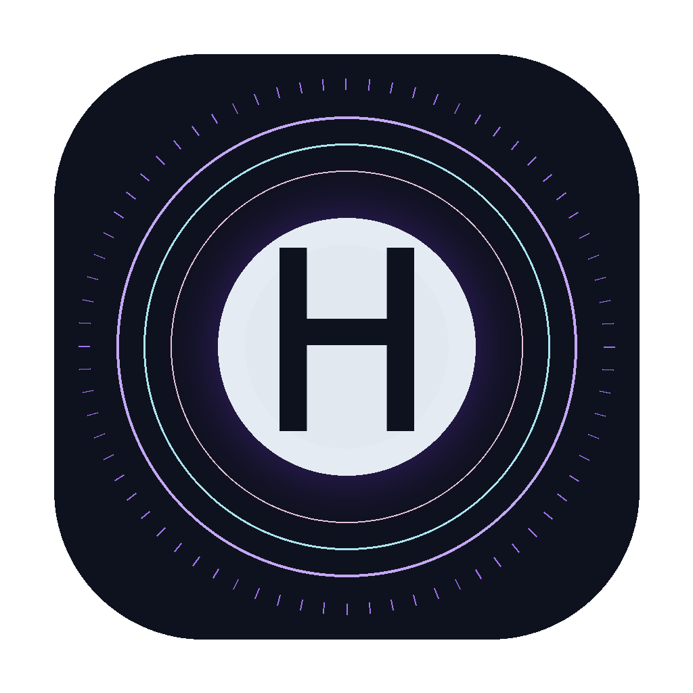

<div align="center">



# Harry · Intelligence

**Voice-only agentic AI for macOS — JARVIS / FRIDAY-style — with a pixel-perfect React orb UI, Hermes-style orchestrator, 98-skill catalogue, computer-use agent, bilingual EN+TA voice, Obsidian-vault memory, and a pluggable LLM brain.**

[](https://www.python.org/)
[](LICENSE)
[](#brain-backends)
[](#the-98-skill-catalogue)
[](#install)

</div>

---

## Install

**The one-liner** — clones, sets up a venv, installs Harry, runs onboarding, builds the `.app`:

```bash
curl -sSL https://raw.githubusercontent.com/rudhrancodes-dev/harry-ai/main/install.sh | bash
```

After it finishes, launch in either way:

```bash
harry                    # CLI (opens the UI in your browser)
open ~/Applications/Harry.app    # native double-click
```

**Already cloned?**

```bash
pip install -e .
harry-onboard --yes
harry
```

**Want the desktop app only?** Grab `Harry.dmg` from the [Releases page](https://github.com/rudhrancodes-dev/harry-ai/releases), mount it, drag `Harry.app` to `/Applications`. It still expects the install location at `~/Apps/harry-ai` (run the one-liner first).

---

## What it is

Harry is a real Tony-Stark-style assistant. **You speak to it. It speaks back.** A pixel-perfect React orb UI sits on top of a Python backend that runs the Hermes-style agent stack. Pluggable brains, bilingual voice, persistent memory in an Obsidian vault, runtime brain-switching from the Settings drawer.

| | |
| --- | --- |
| 🪄 **Wake greeting** | Time-aware, personalised — "Burning the midnight oil, Rudhran?" / "மீண்டும் வருக, ருத்ரன்." |
| 🗣 **Bilingual** | English + Tamil. Auto-detects per utterance. macOS `say -v Daniel` / `Vani` for TTS. |
| 🔁 **Brain switcher** | Claude Pro · OpenRouter (DeepSeek V3) · OpenAI-compatible (opencode/Ollama). Switch live in the Settings drawer, no restart. |
| 🎙 **Speaker ID** | Optional voiceprint verification — `harry-enroll` records you reading 10 prompts, after that only your voice unlocks Harry. |
| 🧠 **Memory** | Obsidian vault at `~/Documents/HarryVault`. Every turn lands in `Sessions/YYYY-MM-DD.md`. Open it in Obsidian. |
| 🖱 **Computer use** | Click / move / type / scroll your actual cursor. `cliclick` + AppleScript. |
| 🧰 **98 skills** | Globally unique trigger phrases, enforced by tests. Dice, calculator, screenshot, recipes, regex, weather, etc. |
| 💻 **Code agent** | "Harry, code python that reverses a string into reverse.py" → file appears in `~/.harry/workspace/`. |

## The UI

The frontend is the **Harry · Intelligence** design (Claude Design export, ~2300 lines of HTML/CSS/JSX) embedded as-is in `webapp/`. Three orb styles (Jarvis particle sphere, iridescent sphere, waveform), three themes (Solaris, Iridescent, Obsidian), a tweaks panel, transcript drawer, agent log, drag-to-reposition orb. A non-invasive `settings-patch.jsx` injects a brain-backend dropdown into the existing Settings drawer without touching `app.jsx`.

Demo:

| State | |
| :--- | :--- |
| Idle | *"Good morning, Rudhran. Standing by."* |
| Wake | *"I'm listening."* |
| Listening | live STT caption with confidence |
| Thinking | *"One moment, Rudhran."* |
| Tool | active tool card + agent log (top right) |
| Speaking | live caption of Harry's reply |

## Brain backends

| Backend         | What it does                                                            | What it needs                                              |
| --------------- | ----------------------------------------------------------------------- | ---------------------------------------------------------- |
| `claude-code`   | Shells out to the `claude` CLI in non-interactive mode (`claude -p`). Uses your **Claude Pro / Max** plan — browser-authenticated, **no API key required**. | `claude` on PATH and `claude /login` once.                 |
| `openrouter`    | One key, hundreds of models. Default model: **DeepSeek V3** (`deepseek/deepseek-chat-v3-0324`). | `OPENROUTER_API_KEY`, optionally `OPENROUTER_MODEL`.       |
| `openai-compat` | Any OpenAI-compatible endpoint — **opencode**, Ollama, vLLM, DeepSeek direct, Groq, Together, LM Studio. | `OPENCODE_API_KEY` (if needed), `OPENCODE_BASE_URL`, `OPENCODE_MODEL`. |
| `off`           | Disable the LLM entirely; only deterministic skills will work.          | nothing.                                                   |

**Switch at runtime** from the Settings drawer (cogwheel, lower right). The backend writes your choice to `.env` and reloads the orchestrator on the next turn — no restart needed.

## Speaker recognition

```bash
pip install -e ".[speakerid]"     # installs resemblyzer (~150 MB torch dep)
harry-enroll                       # reads 10 prompts, builds your voiceprint
```

The profile lives at `~/.harry/voiceprint.npy`. Once enrolled, the listener rejects voices below cosine similarity `HARRY_SPEAKER_THRESHOLD` (default 0.78). When not enrolled, verification is a no-op so Harry still works for anyone.

## Memory in an Obsidian vault

First launch creates `~/Documents/HarryVault/` with:

```
HarryVault/
├── .obsidian/app.json
├── README.md
├── Sessions/
│   └── 2026-05-26.md       ← today, appended each turn with frontmatter
└── People/
    └── Rudhran.md           ← long-lived facts Harry learns about you
```

Open the folder as a vault in Obsidian (`Open folder as vault…`). Harry can recall the last session into the conversation context for continuity.

## The 98 skills

`harry/skills/registry.py` defines exactly **98 skills**. **Every trigger phrase is globally unique** — `tests/test_skills.py` fails the build if uniqueness ever regresses.

Eleven categories: info · creative · productivity · comm · knowledge · code · system · health · ent · math · social.

## Project layout

```
harry-ai/
├── webapp/                            # the Claude-Design React UI (embedded as-is)
│   ├── index.html
│   ├── app.css · app.jsx · orb.jsx · tweaks-panel.jsx
│   ├── greetings.js                   # English pool (yours)
│   ├── greetings-ta.js                # Tamil pool (added)
│   ├── greetings-bilingual.js         # selector glue
│   ├── harry-bridge.js                # WebSocket client → /ws
│   └── settings-patch.jsx             # injects brain-switcher into Settings
├── harry/
│   ├── server.py                      # FastAPI app — static UI + /api/* + /ws
│   ├── cli.py                         # `harry` — opens browser, runs server
│   ├── onboard.py                     # `harry-onboard` — first-run setup
│   ├── enroll.py                      # `harry-enroll` — voiceprint enrollment
│   ├── greetings.py                   # Python-side bilingual greeting picker
│   ├── memory.py                      # Obsidian vault writer / reader
│   ├── persona.py
│   ├── config.py
│   ├── brain/                         # pluggable LLM backends
│   ├── voice/
│   │   ├── listener.py                # bilingual STT (en-IN + ta-IN)
│   │   ├── speaker.py                 # bilingual TTS (Daniel / Vani)
│   │   └── speaker_id.py              # resemblyzer voiceprint verifier
│   ├── agents/                        # time / weather / system / computer / code / conversation
│   └── skills/                        # 98-skill catalogue + Hermes router
├── scripts/
│   ├── make-icon.py                   # generates the iridescent Harry logo
│   └── build-app.sh                   # builds Harry.app + Harry.dmg
├── assets/
│   └── harry-icon-1024.png
├── install.sh                         # one-line installer
├── pyproject.toml                     # console scripts: harry · harry-onboard · harry-enroll
├── tests/                             # 10 passing: orchestrator + catalogue invariants
└── dist/                              # Harry.app + Harry.dmg (built, gitignored)
```

## Configuration

Set via `.env` (project root) or `~/.config/harry/.env` (after `harry-onboard`). The Settings drawer writes the same keys live.

| Env var                 | Default                          |
| ----------------------- | -------------------------------- |
| `HARRY_BRAIN`           | `claude-code`                    |
| `HARRY_LANGUAGE`        | `en` (`en` · `ta` · `auto`)      |
| `HARRY_USER_NAME`       | `Rudhran`                        |
| `HARRY_ADDRESS`         | `sir`                            |
| `HARRY_WAKE_WORD`       | `harry`                          |
| `HARRY_VAULT`           | `~/Documents/HarryVault`         |
| `HARRY_HOST`            | `127.0.0.1`                      |
| `HARRY_PORT`            | `7424`                           |
| `HARRY_SPEAKER_THRESHOLD` | `0.78`                         |
| `OPENROUTER_API_KEY`    | *(empty)*                        |
| `OPENROUTER_MODEL`      | `deepseek/deepseek-chat-v3-0324` |
| `OPENCODE_API_KEY`      | *(empty)*                        |
| `OPENCODE_BASE_URL`     | `http://localhost:11434/v1`      |
| `OPENCODE_MODEL`        | `deepseek-chat`                  |

## Running tests

```bash
python -m pytest -q
```

Covers orchestrator routing **and** the 98-skill catalogue invariants — uniqueness of every trigger phrase, uniqueness of ids, every handler registered, every LLM skill has a prompt.

## Roadmap

- [ ] Streaming TTS so Harry speaks before generation completes
- [ ] Native tool-use API on each Brain backend (true function calling)
- [ ] Cross-platform Computer Agent (Windows / Linux via `pyautogui`)
- [ ] Hot-reload skill packs from `~/.harry/skills/*.py`
- [ ] Vector memory layer over the Obsidian vault for semantic recall
- [ ] Whisper local STT (replace SpeechRecognition's Google backend)

## Credits

- **Design** — your own export from [Claude Design](https://claude.ai/design), embedded verbatim
- **Brain** — Anthropic Claude (via the `claude` CLI), DeepSeek, OpenRouter, opencode
- **Voiceprint** — [Resemblyzer](https://github.com/resemble-ai/Resemblyzer)
- **Hermes pattern** — [NousResearch Hermes](https://github.com/NousResearch)
- **Inspiration** — JARVIS & FRIDAY (Iron Man), Aegis ([rudhran.netlify.app](https://rudhran.netlify.app))

## License

MIT © [Rudhran B.](https://github.com/rudhrancodes-dev)
